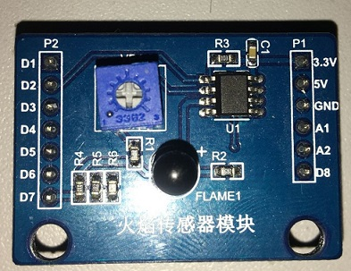
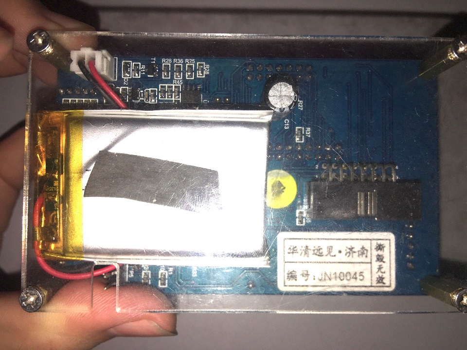

 # STM32F051K8

> Flame and Voltage detection with STM32F051K8
>
> Also see : [https://gitee.com/zhj0125/STM32F051K8](https://gitee.com/zhj0125/STM32F051K8)


## 1. ADC Acquisition

```c
for(int i=0;i<2;i++){
    HAL_ADC_Start(&hadc);
    HAL_ADC_PollForConversion(&hadc,100);
    value[i] = HAL_ADC_GetValue(&hadc);
    HAL_Delay(200);
}
HAL_ADC_Stop(&hadc);
```

## 2. Data Conversion

```c
Battery = value[0]*3.3/4096.0;
Fire = (int)value[1];
printf("BAT = %.2lf V\t", Battery);
printf("Fire = %d\n", Fire);
```

## 3. Gallery

### Overall


### FlameSensor



### Battery



### Serial Communication


